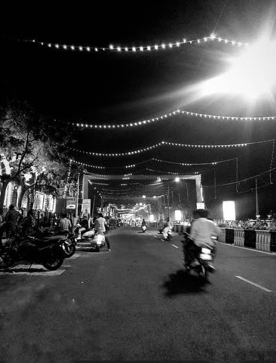

# सितारें हर साल के

हर साल मैं \
&nbsp;&nbsp;&nbsp;इन सितारों के नीचे खुद को पाता हूँ।

इन्हें देख मैं \
&nbsp;&nbsp;&nbsp;साल भर की रोशनी अपने साथ ले जाता हूँ।

लेकिन हर बार यह रोशनी मैं \
&nbsp;&nbsp;&nbsp;अगले सितारों से पहले ही खत्म कर देता हूँ।

थोड़ी रोशनी मैं \
&nbsp;&nbsp;&nbsp;कभी कभी दूसरों में बांट देता हूँ।

बाकी थोड़ी रोशनी मैं \
&nbsp;&nbsp;&nbsp;दोस्तों से उधार मांग के काम चला लेता हूँ।
